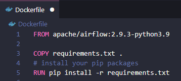
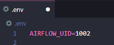

# **Tutorial de instalação do  Airflow local**

Neste tutorial, vamos instalar o Airflow local, entender e aplicar algumas configurações importantes da instalação, além de desenvolver um case prático criando uma DAG usando **`Python`**.

Bora?

## **Passo a passo para instalação do Airflow local no Docker com Windows 11**

### Pré-requisitos:
- Conhecimento básico de Docker, Airflow e Python.
- Windows 11 na versão 64-bit com o WSL 2 habilitado.
- Docker instalado no Windows 11.

### Parte 1: Instalando o Docker Desktop no Windows 11

1. Verifique a compatibilidade:
- Certifique-se de que a **virtualização** esteja habilitada no BIOS do seu computador (pressione `Ctrl + Shift + Esc`, vá para aba de desempenho e verifique a virtualização).
- O Windows 11 precisa estar rodando na versão **64-bit** com o **WSL 2 habilitado**.

2. Instale o Docker Desktop:
- Baixe o Docker Desktop para Windows diretamente do [**site oficial do Docker**](https://www.docker.com/).
- Após o download, execute o instalador e siga as instruções:
  - Aceite os termos de licença.
  - Selecione a opção de instalar o Docker com suporte ao WSL 2 (Windows Subsystem for Linux 2).
  - Complete a instalação e reinicie o sistema quando solicitado.

3. Verifique a instalação:
- Após a instalação, abra um terminal **`PowerShell`** ou **`CMD`** e execute o comando abaixo:

    ```Bash
    docker --version
    ```
- Se o **Docker Desktop** estiver funcionando corretamente, ele exibirá a versão instalada conforme a imagem abaixo:

    

### Parte 2: Configurar o Airflow no Docker

Nesta parte vamos instalar a **versão 2.9.3 do Airflow**. Confira [aqui no site do Airflow a documentação dessa versão.](https://Airflow.apache.org/docs/apache-Airflow/2.9.3/). Tem muitas dicas legais sobre a instalação, configurações e principalmente de uso para montar DAGs.

Vamos lá...

1. Crie a estrutura de diretórios e arquivos do projeto conforme abaixo:
- **Clone** esse projeto do GitHub em um diretório no seu PC ou crie a mesma estrutura de pastas em um diretório no seu PC.
- Essa estrutura de pastas vão começar a fazer sentido conforme seguirmos com o tutorial, vou explicar como elas vão funcionar.
  
   

   Obs.: Eu costumo usar o **VS Code** para estruturar os meus projetos e neste exemplo o diretório se chama *Airflow-docker-local*. É nele que vamos criar e entender cada arquivo desse projeto.
   
2. Crie ou copie o arquivo **`docker-compose.yaml`** dentro do seu diretório raiz:
- Esse arquivo contém todas as configurações dos containers que precisamos criar, no caso são:
  - **redis**: o Redis é um banco de dados de código aberto que armazena dados na memória e é um ponto de comunicação entre o Airflow e os Workers, funcionando de forma assíncrona e buferizada.
  - **postgres**: o PostgreSQL é um banco de dados relacional onde o Ariflow armazena todo seu histórico e configurações das DAGs.
  - **apache/Airflow**: é o container onde será executada a aplicação do Airflow como serviço usando o **redis** e o **postgres**.
  
- Você pode copiar esse arquivo do site do Airflow >> [docker-compose.yaml](https://Airflow.apache.org/docs/apache-Airflow/2.9.3/docker-compose.yaml)
- Ou baixar/usar o exemplo desse projeto.
  
  **Qual a diferença?**

  No arquivo do projeto eu fiz algumas customizações, ou seja, adaptações para o case que vamos testar, veja:

  - Nessa linha alteramos a variável `Airflow__CORE__LOAD_EXAMPLES` para `'false'`, pois não queremos carregar os VÁRIOS exemplos prontos de DAGs na imagem do Airflow.

    

  - Nessa parte, incluimos mais um volume chamado `dados`, é uma pasta compartilhada entre seu PC e o container do Airflow para troca de arquivos, ou seja, esses volumes são as pastas da raiz do seu projeto onde vamos "trocar" arquivos entre seu PC e o Airflow. 
  
    

    - Por exemplo, o volume chamado `dags` será onde você vai colocar os scritps em `Python` para carregar as DAGs automaticamente dentro do Airflow. Top isso, neh?

  - **Dica:** Sugiro que vocês leiam a documentação e questionem as configurações desse arquivo **`docker-compose.yaml`**, pois é nele que vocês vão determinar as principais configurações dos containers e serviços para o Airflow funcionar.

3. Crie ou copie o arquivo **`Dockerfile`** dentro do seu diretório raiz:
- Esse arquivo é respossável por definir o que vamos instalar no container do Airflow, no caso vamos definir a versão do `Python` que vamos usar e as bibliotecas que vamos precisar. Essas bibliotecas estão definidas no arquivo `requirements.txt` que vamos ver asseguir.
  
    

4. Crie ou copie o arquivo **`requirements.txt`** dentro do seu diretório raiz:
- Esse arquivo contém as bibliotecas que vamos instalar no `Python` do Airflow, ou seja, são as bibliotecas que os programas vão depender.

    

  - Obs.: Esse arquivo será "vivo", você precisa colocar aqui as bibliotecas que deseja instalar no `Python` do "Airflow".

5. Crie ou copie o arquivo **`.env`** dentro do seu diretório raiz:
- Esse arquivo é onde podemos definir algumas configurações de ambiente. Como variáveis de ambiente para usar no Airflow ou nos seus scripts. Por exemplo: variáveis de credenciais, definição de ambiente PROD, DEV ou HML, entre outras...

    

  - Essa configuração, foi uma recomentação da documentação.

**Pronto, agora podemos executar e criar nossos containers e "subir" o Airflow.**

6. Inicializar os serviços dos containers:
- Esse passo é respossável por inicializar os bancos de dados do Airflow e executar as tarefas de configurações necessárias na primeira vez que o Airflow é iniciado, ou seja, aqui vamos preperar o "terreno" para iniciar o serviço do Airflow.
- Abra o `PowerShell` ou `CMD` na pasta raiz do nosso projeto (no meu caso será a pasta `Airflow-docker-local`) e execute o comando abaixo:

    ```Bash
    docker-compose up Airflow-init
    ```
  Veja: 
  

  - Obs.: é normal demorar, pois nessa hora estamos baixando as imagens dos containers, configurando conforme as parâmetrizações que fizemos e inicializando alguns serviços.
  
  - Dica: Sempre que fizer alguma alteração de configuração dos containers é importante repetir esse passo antes de iniciar o serviço do Airflow.

7. Iniciar o Airflow:
- Nessa parte você tem que rezar... rsrs (brincadeira)
- Se tudo estiver bem configurado de acordo com o passo a passo, você pode iniciar o serviço do Airflow executando esse comando na mesma sessão do `PowerShell` ou `CMD` do passo anterior:

    ```Bash
    docker-compose up
    ```
  Veja: 
  

**Pronto, agora seu Airflow está no "AR"**

8. Acesse o Airflow:
- Por padrão o serviço será inicado no `localhost` na porta `8080`. Acesse pelo link abaixo:
  - http://localhost:8080/home

- Para acessar o Airflow você deve usar o login = `Airflow` e a senha = `Airflow`:

  

- Veja que no Docker Desktop aparecerá os containers iniciados:

  


9. Finalizar os serviços do Airflow:
- Para finalizar os serviços do Airflow, execute o comando abaixo no `PowerShell` ou `CMD` no diretório raiz do projeto:
    ```Bash
    docker-compose down
    ```

## **Criando uma DAG no Airflow**

Nessa parte vamos criar uma **DAG simples** para testar o ArFlow.

Bom, primeiro temos que definir o que vamos testar, ou seja, qual o case?

### Case:

> Vamos simular um processo que vai ler um arquivo em **`.csv`**, validar se o arquivo esperado existe, se o arquivo existir, ele vai carregar o arquivo em um dataframe do ***pandas*** e vai salvará um novo arquivo em um determinado diretório (output) incuindo uma data de processamento dentro do arquivo. Caso o arquivo não exista, a DAG vai enviar uma mensagem na console de log do Airflow e vai finalizar com sucesso.

**Detalhes do processo:**
- Template do arquivo:  `dados_clima_YYYYMMDD.csv`:
  - Arquivo tipo CSV padrão com delimitador: `,` (vírgula).
  - "dados_clima_" é o prefixo do arquivo.
  - "YYYYMMDD" é a data do arquivo, onde: YYYY = ano, MM = mês e DD = dia.
- Vamos ler o arquivo do diretório `./dados`
- Vamos salvar o arquivo no diretório `./dados/output`

  Veja a estrutura de pastas:

    

**Montando a DAG**

O intuito aqui **NÂO** é ensinar a programrar ou aprofundar em como criar uma DAG e sim testar o Airflow, ok?

Para a DAG carregar no Airflow precisamos criar um arquivo tipo `.py`, ou seja, tipo `Python` e carrega-lo na pasta `./dags`.
- Obs.: Lembra da configuração de volumes no arquivo `docker-compose.yaml` que fizemos? A pasta `./dags` da raiz do seu projeto já vai sincronizar automaticamente com o Airflow quando você carregar algum arquivo `.py` neste diretório.

- Veja como fica na raiz do projeto: 

  

- Dica: Sugiro que explore o arquivo `.dags/processa_csv.py`, pois tentei explicar bem cada etapa do processo com os comentários.

### Veja como ficou nossa DAG no Airflow:


Observe que ela está desativada, para isso você precisa ativa-la manualmente ou iniciar a DAG com o run.

  - Ativando a DAG:
  
    
  
  - ou, ininicando uma execução:
  
    


### Uhullll, nossa DAG rodou!!!


Não se assuste, nossa DAG vai executar de minuto em minuto, você pode alterar isso depois nas configurações da DAG no arquivo `.dags/processa_csv.py`.

### Agora é com vocês, espero que tenha ajudado!!!

----------------
----------------

## Referências: 
- [Site do Airflow](https://airflow.apache.org/)
- [Documentação de instalação do Airflow](https://airflow.apache.org/docs/apache-airflow/2.9.3/start.html)
- [Site da Docker](https://www.docker.com/)